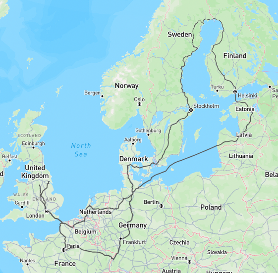

# trips-to-europe

A collection of GPX/GeoJson traces from trips to Europe. They look the best when trains are involved. The best reason to be anti-flying.

view on <https://alifeee.co.uk/europe-trips/>

Trips:

- [2018-08 Paris](./2018-08%20Paris/)
- [2022-07 interrail](./2022-07%20interrail/)
- [2023-07 keptp](./2023-07%20keptp/)
- [2024-12 CCC](./2024-12%20CCC/)
- [2025-04 blummit](./2025-04%20blummit/)



## Collecting GPX traces

How to get GPX files. Empty rows I haven't done before but <https://brouter.damsy.net/> may be apt.

| mode of transport | site(s) | output format |
| --- | --- | --- |
| train | route on <https://brouter.damsy.net/> and export | gpx |
| car/bus | route on <https://brouter.damsy.net/> and export | gpx |
| ferry | find ID via query on [OSM](https://www.openstreetmap.org) ([e.g.,](https://www.openstreetmap.org/way/1343490175)), then run query like `way(1343490175); out geom;` on <https://overpass-turbo.eu/> and export | geojson/gpx/kml |
| bike | ??? | ??? |
| plane | ??? | ??? |
| on foot | ??? | ??? |

## Converting filetypes

The `gdal-bin` package can probably do whatever conversion you want. If you're going from gpx, you may need to add `tracks` to the command. Also, the `from`/`to` arguments seem swapped (`to` is first).

```bash
sudo apt install gdal-bin
# convert GEOJSON -> KML
ogr2ogr route.kml route.geojson
# convert GPX -> GEOJSON
ogr2ogr route.geojson route.gpx tracks
```

## Viewing data

View files nicely (as a preview) on:

| filetype | website | notes |
| --- | --- | --- |
| `.gpx` | <https://gpx.studio/app> | |
| `.geojson` | <https://geojson.io/> | |
| `.kml` | ??? | |
| other | ??? | |

## Combining GPX traces

Name the traces something nice, that when sorted, is in order.

I don't know how to combine/merge `.gpx` files. I do know how to merge `.geojson` files, so I just turn them into those and merge that.

```bash
# convert to geojson
mkdir geojson
for file in gpx/*; do
  bn="${file#*/}"
  ogr2ogr "geojson/${bn%*.gpx}.geojson" "${file}" tracks
done
```

…combine geojson

```bash
# combine geojson
endfile="all.geojson"
while read file; do
  cat "${file}";
done <<< $(find geojson -type f | sort -n) | jq -c --slurp '{
    "type": "FeatureCollection",
    "name": "combined",
    "features": ([.[] | .features[0]])
}' > "${endfile}"
# remove "messages" and "times" from properties (from brouter train router)
#   and remove height coordinate from coordinate strings
cat "${endfile}" \
  | jq -c '
    .features[].properties |= del(.messages) |
    .features[].properties |= del(.times) |
    .features[] |= (
      if .geometry.type == "MultiLineString" then
        .geometry.coordinates |= (.[] |= (.[] |= del(.[2])))
      elif .geometry.type == "LineString" then
        .geometry.coordinates |= (.[] |= del(.[2]))
      else
        .
      end
  )'\
  | sponge "${endfile}"
```

combine all geojson files into one:

```bash
files=("2018-08 Paris/all.geojson" "2022-07 interrail/all.geojson" "2023-07 keptp/all.geojson" "2024-12 CCC/all.geojson" "2025-04 blummit/all.geojson")
for file in "${files[@]}"; do
  printf '{"key": "%s", "value": ' "${file}"
  cat "${file}" | jq -c
  printf "}"
done | jq --slurp -c 'from_entries' > all.json
```
